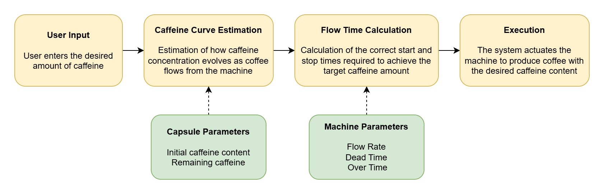
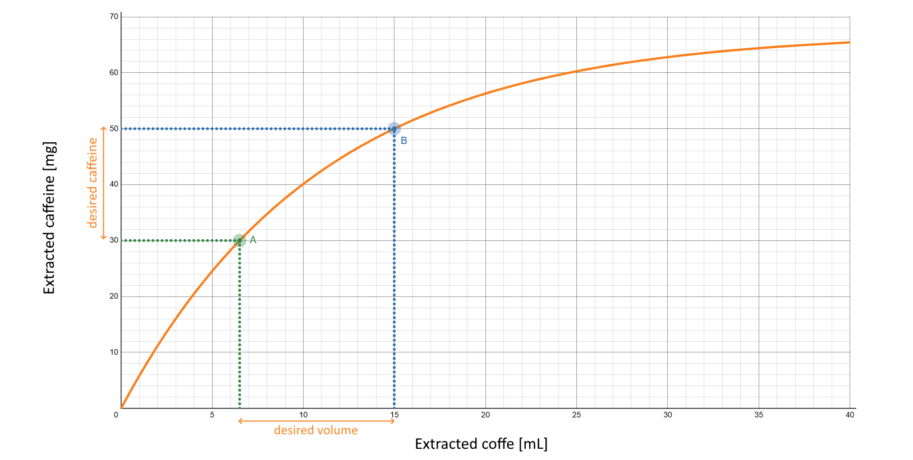
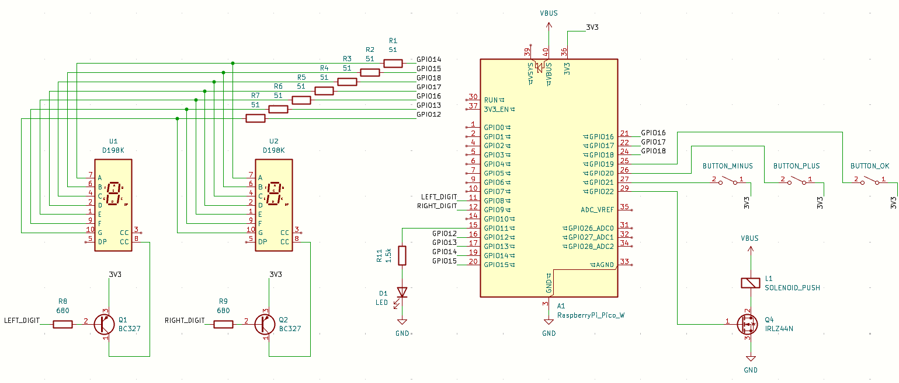

# Caffeine Content – Control of Your Coffee’s Caffeine Level

  
  
  

## 📌 Project Overview
This project implements a system that lets you control the caffeine level of your coffee. While caffeine can help maintain focus, the amount in a typical espresso is often excessive and may lead to a mental crash some time later, especially after lunch or eating. This system gives you control by allowing smaller, more frequent doses instead of large, infrequent ones.

The diagram below illustrates the process:

## ⚙️ How It Works
The system models the caffeine extraction curve, calculates the correct start and stop times for the coffee machine, and actuates the machine to produce a coffee with the desired caffeine level.

The diagram below illustrates the process:

---
## 💻 Software Requirements
- Arduino IDE 2.x
- Raspberry Pi Pico Board (from earlephilhower) version 4.5.2 or later 

## 🧩 List of Components
- Raspberry Pi Pico running the firmware
Solenoid/electromagnetic actuator — presses the coffee machine button
-1× LED + 1.5 kΩ resistor — indicates invalid caffeine selection (below minimum or above available caffeine)
- 2× PNP transistors with Ic ≥ 200 mA (e.g., BC327) + 2× 680 Ω resistors — drive the two 7‑segment displays
- 1× logic‑level NMOS or NPN transistor capable of driving the solenoid (e.g., IRLZ44N)
- 2x 7-segments display + 7x 51Ω resistors - display caffeine level
- 3× buttons — increase (+), decrease (–), and confirm/reset (OK)
  
## 🔌 Circuit Assembly

### Notes:
- The displays are multiplexed: all segment pins are connected in parallel, and the anodes are alternated activated by the driving transistors
- The buttons are connected to the 3.3 V rail, with internal pull‑down resistors configured in software (Buttons.cpp/h).

  
   
  <em>a) Sensor detail &emsp;&emsp;&emsp;&emsp;&emsp;&emsp;  b) Breadboard assembly</em>

  
   
  <em>Sensors connected in matrix form</em>

---

## 🚀 How to Use

